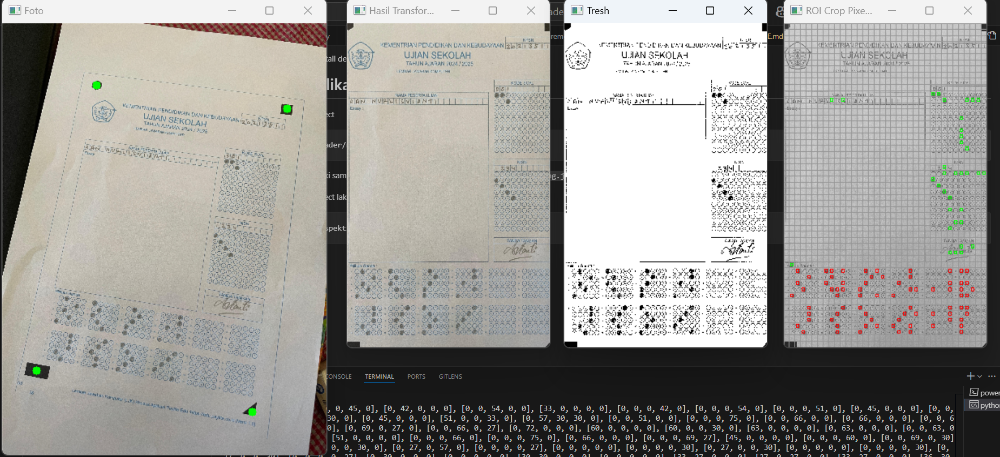

# paylite-ljk-reader
Pembaca Lembar Jawaban Komputer (LJK)

# Requirement

- Python 3.8+

# Persiapan

Lakukan Clone repository : 
```
git clone https://github.com/nurramdandoni/paylite-ljk-reader.git
```

Membuat Virtual Environment
```
python -m venv envLjk
```

Aktifkan Environment
```
cd envLjk\Scripts\activate

activate
```

Selelah aktif kembali ke root project :
```
cd ../..
```

# Install Requirement
Untuk menjalankan project diperlukan beberapa dependency, untuk melakukan installasi lakukan perintah berikut :
```
pip install -r requirement
```

Setelah semuanya teirnstall dengan baik maka saatnya menjalankan project

# Running Aplikasi
Masuk Ke directory project
```
cd paylite-ljk-reader/reader
```
Project ini sudah memiliki sample untuk dicoba menggunakan contoh file : `./ljk_miring.jpg` dan `./ljk_miring2.jpg`

Untuk menjalankan Project lakukan perintah :
```
python manual_perspektif.py
```

Maka akan muncul tampilan berikut : Lakukan Penandaan pada masing2 object dimulai dari Kiri atas, Kanan atas, Kanan bawah dan Kiri bawah (Searah Jarum Jam)


Setelah Marking Selesai akan terlihat seperti berikut :



Berikut adalah yang terlihat di console


Informasi diatas menunjukan Jumlah Pixel hitam pada masing2 opsi di setiap nomor : 
```
[[0, 60, 0, 0, 0],...]
```

dari informasi ini kita tahu bahwa Nomor 1 pada Opsi A, B, C, D, E masing- masing memiliki Pixel hitam sebanyak 0,60,0,0,0
untuk menentukan jawaban mana yang dipilih peserta ujian adalah dengan melakukan pencarian index dengan nilai maximal pada array tersebut, maka pada Nomor 1 Memiliki Jawaban `B`

# Stop Aplikasi
Untuk Melakukan stop pada aplikasi dengan cara menutup semua Windows yang sedang terbuka

# Deaktivasi Environment
Untuk menonaktifkan environment dengan cara :
```
deactivate
```

#Web Version
- Comming Soon in 2025
- Image registry